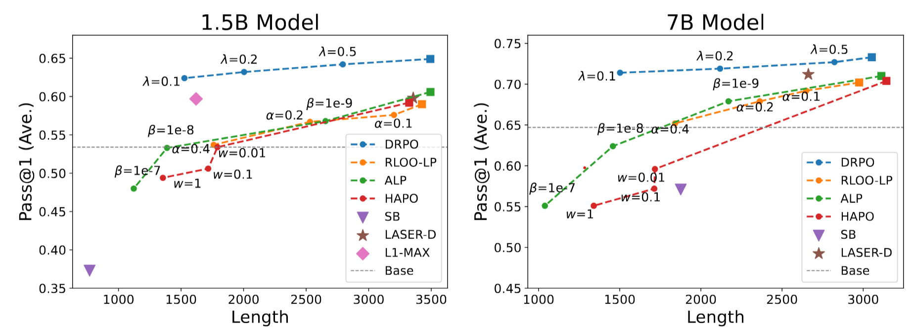

<h1 align="center">🚀 DRPO: Efficient Reasoning via Decoupled Reward Policy Optimization</h1>


📢 **[Jan 2026]:**
Our paper "DRPO: Efficient Reasoning via Decoupled Reward Policy Optimization" has been **accepted to ICLR 2026** 🎉.


---
Paper link: [arXiv](https://arxiv.org/abs/2510.04474)

### 🔍 Why **DRPO ?** - *Decoupled Reward Policy Optimization* 

While existing methods incorporate **length rewards** to GRPO to promote concise reasoning, they incur **significant performance degradation**. We identify the root cause: when rewards for correct but long rollouts are penalized, GRPO's group-relative advantage function can assign them negative advantages, actively discouraging valid reasoning. 

**DRPO** is a novel framework that **decouples the length-based learning signal of correct rollouts from incorrect ones**. DRPO is grounded in integrating an optimized positive data distribution, which maximizes length-based rewards under a KL regularization, into a discriminative objective. We derive a closed-form solution for this distribution for efficient learning.

---

### 📈 Quick Results


Comparison of performance-efficiency trade-off.  Left is for fine-tuning 1.5B model and right is for fine-tuning 7B model. Grey lines represent the base model performance before finetuning, with generation length of 4698 for 1.5B model and 4119 for 7B model. Squares denote models trained with reference methods without length penalties (i.e., $\lambda$=+ $\infty$ for DRPO, $\alpha=0$ for RLOO-LP, $\beta=0$ for ALP, $w=0$ for HAPO). Triangle, star, and rhombus markers represent models trained by other works.

<p align="center"></p>


---

- [Model Checkpoints](#model-checkpoints)
- [Getting Started](#getting-started)
    - [Installation](#installation)
    - [Datasets](#datasets)
    - [Training](#training)
    - [Evaluation](#evaluation)
- [Citing DRPO](#citing-DRPO)


## Model Checkpoints

- DRPO finetuned DeepSeek-R1-Distill-Qwen-1.5B Model: [DRPO-1.5B-Lambda-0.1](https://huggingface.co/ganglii/DRPO-1.5B)
- DRPO finetuned DeepSeek-R1-Distill-Qwen-1.5B Model: [DRPO-1.5B-Lambda-0.2](https://huggingface.co/ganglii/DRPO-1.5B-Lambda-0.2)
- DRPO finetuned DeepSeek-R1-Distill-Qwen-1.5B Model: [DRPO-1.5B-Lambda-0.5](https://huggingface.co/ganglii/DRPO-1.5B-Lambda-0.5)
- DRPO finetuned DeepSeek-R1-Distill-Qwen-7B Model: [DRPO-7B-Lambda-0.1](https://huggingface.co/ganglii/DRPO-7B)
- DRPO finetuned DeepSeek-R1-Distill-Qwen-7B Model: [DRPO-7B-Lambda-0.2](https://huggingface.co/ganglii/DRPO-7B-Lambda-0.2)
- DRPO finetuned DeepSeek-R1-Distill-Qwen-7B Model: [DRPO-7B-Lambda-0.5](https://huggingface.co/ganglii/DRPO-7B-Lambda-0.5)

Since models with `Lambda=0.2` and `Lambda=0.5` were reproduced to facilitate comparisons with our method, their performance may differ slightly from the results reported in the paper.


## Getting Started
### Installation
```bash
# Recommend Python 3.10.
conda create -n drpo python=3.10
conda activate drpo
git clone https://github.com/Optimization-AI/DRPO.git
cd DRPO
pip install -e ./verl
pip install -e ./deepscaler
pip install wandb
```

If the above commands fail to install `flash_attn==2.7.3`, please try installing  it separately with the following command:
```bash
pip install https://github.com/Dao-AILab/flash-attention/releases/download/v2.7.3/flash_attn-2.7.3%2Bcu12torch2.4cxx11abiFALSE-cp310-cp310-linux_x86_64.whl
```
### Datasets

Datesets utilized in our training are included in the `datasets` folder. Feel free to adapt  file `scripts/data/deepscaler_dataset.py` to generate your own datasets.


### Training

We provide training scripts for both single-node and multi-node setups in `scripts/train/`.

#### Single-Node Training (8 GPUs)
We start with one node for training 1.5B Qwen models with 8k context, with 8 A100-80GB GPUs.
```bash
bash ./scripts/train/run_drpo_1.5b_8k.sh   #### DRPO 
```

#### Multi-Node Training

To train with longer context or larger models, multi-node training is necessary. To achieve this, follow these steps:

1. On the head node:
```bash
# Set XFormers backend to avoid CUDA errors
export VLLM_ATTENTION_BACKEND=XFORMERS
# Start Ray head node
ray start --head
```

2. On each worker node:
```bash
# Set XFormers backend to avoid CUDA errors
export VLLM_ATTENTION_BACKEND=XFORMERS
# Connect to head node (replace with your head node's address)
ray start --address=[RAY_ADDRESS]
```

3. Finally, on the head node, run the training script, such as:
```bash
bash ./scripts/train/run_drpo_1.5b_8k.sh
```


## Evaluation

Our evaluation scripts automatically runs vLLM to generate 16 samples for each problem. To run our evaluation scripts, run:
```bash
bash ./scripts/eval/eval_model.sh --model [CHECKPOINT_PATH] --datasets [DATASET1] [DATASET2] --output-dir [OUTPUT_DIR]
```

We report Pass@1 accuracy averaged over 16 samples for each problem. To replicate our reported numbers, for example, run:

```bash
bash ./scripts/eval/eval_model.sh --model ganglii/DRPO-1.5B --datasets aime aime25 olympiad_bench math gsm8k --output-dir ./val_results/DRPO-1.5B
```

## Acknowledgements
- Our training pipeline is built on the Github repository [DeepScaleR](https://github.com/agentica-project/rllm/tree/deepscaler) with [Verl](https://github.com/volcengine/verl) framework. We thank the authors for open-sourcing their code.


## Citing DRPO

If you find DRPO useful in your research, please consider citing the following paper:
```bibtex
@article{li2025drpo,
  title={DRPO: Efficient Reasoning via Decoupled Reward Policy Optimization},
  author={Li, Gang and Chen, Yan and Lin, Ming and Yang, Tianbao},
  journal={arXiv preprint arXiv:2510.04474},
  year={2025}
}


